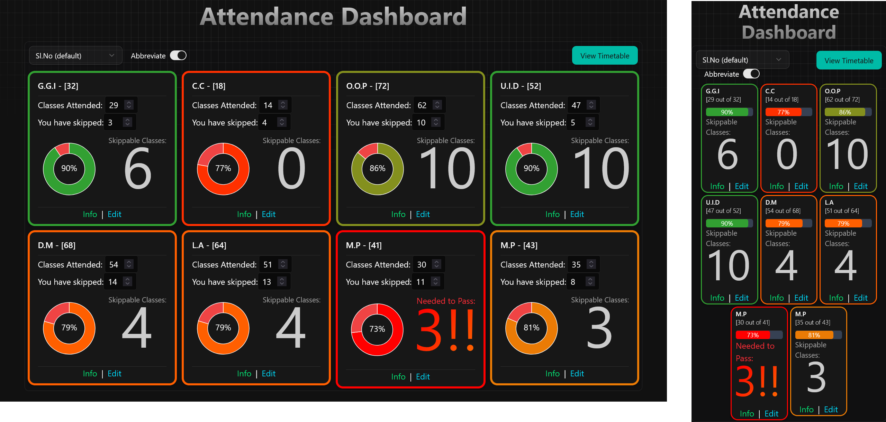

# Student Attendance Dashboard

An informative and user-friendly dashboard designed to help students view their attendance and maintain their desired attendance percentage.

## 🎯 Overview & Features ✨

- Monitor their class attendance across multiple subjects
- Calculate how many more classes they can afford to miss while maintaining their required attendance percentage
- Visualize attendance data through comprehensive charts and graphs
- Access detailed statistics including attendance trends, skip patterns, and semester projections
- View all attendance data centralized in one dashboard for easy monitoring
- Make data-driven decisions about class attendance based on calculated insights

## 🚀 Upcoming Features (Help Welcomed!)

I'm also looking to improve Student Attendance Dashboard (S.A.D). Here are some ideas for future enhancements (contributions are welcome!):

The following features are planned, ordered by priority:

- **Implement Core Functionality**:
  - [ ] **PWA Support**: I need an icon design (oT-T)尸 
  - [ ] **View Timetable Button**: check out [this issue](https://github.com/nithitsuki/sad.nithitsuki.com/issues/1)
  - [ ] **UI/UX Enhancements**: I'm a programmer, but no designer (╥_╥)

- **Lower Priority plans**
  - [ ] **Data Export/Import**: Allow users to back up their data and restore it when needed.
  - [ ] **Semester/Term Management**: Introduce functionality to group subjects by academic terms or semesters.

## 🤝 Contributing
Open an Issue before working on a PR please\
use [origin UI](https://originui.com) components for UI

## 📜 License

This project is licensed under the GNU General Public License v3.0 - see the LICENSE file for details.

---
